# IS 601 - Final Web Application

## Project Description
This project is a team assignment to evaluate our recently acquire knowledge on PyCharm setup with Docker, Flask, MySQL and Postman.

We have created a web application with a [registration\login mechanism](/README.MD#login-and-registration), after you have registered to our website and confirmed your identity. You will have access to our data; the ability to add, delete, edit this data using the [web interface](/README.MD#using-web-interface) and\or [API calls](/README.MD#using-postman) as shown below. Also, you will be able to access our [Dashboards](/README.MD#dashboards) to have a better visibility into our data's statistics.

## Team Members
*   [Luis Chavez Saenz](https://www.linkedin.com/in/luisechavezsaenz/)
*   [Ricardo Torres](https://www.linkedin.com/in/ricardo-torres-484063185/)

## Installation and Usage Instructions

1. Clone the repository to your local computer.
2. Open the project using PyCharm.
3. Add Configuration to use the Docker-compose.yml file to initialize the application.
4. Once the application is running, add the corresponding interpreter to use the app service within the Docker compose file used to initialize the application.
5. Open your browser and access the web application under your localhost on port 5000
6. If this is the first time running the application, please register and verify your email information. Else proceed to the next step.
7. Login using the information provided in the registration form.
8. View, add, edit, and\or delete records using the Web interface or APIs.
9. Access the dashboards site to evaluate the statistics of our data.

## Login and Registration
This feature was developed by Ricardo Torres and Luis Chavez Saenz.

We have created a login page and registration form mechanism. After the application is installed and running; you will be prompted to log in to access our data. If you do not have an account yet, you will first need to register by completing the registration form and verifying your email address.

When the registration process is complete the user data is stored in our database and this information will be checked and validated during login.

## Dashboards
This feature was developed by Luis Chavez Saenz.

Using Chart.js we have created visualizations that enable you to understand our data's statistics better; like the number of Robert Deniro's movies released by per decade, the rating of these movies on a scale from 0 to 100, and the top 10 highest rated movies.

The initial data behind these visualization gets populated from our MySQL database. However, as the user edits, adds or deletes records via the API or the web interface; these visualizations get updated to reflect the new data points.

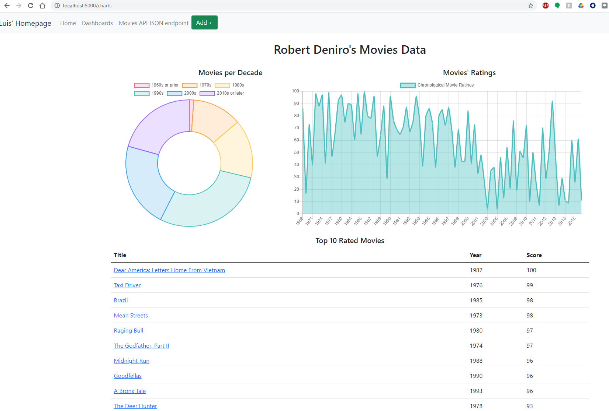

## Using Web Interface
### All Records via Web Interface
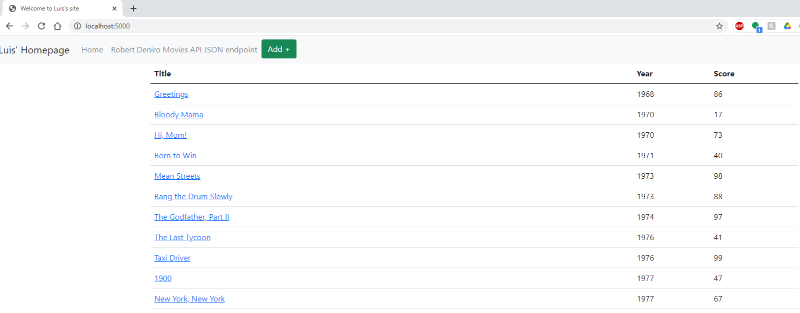

### View One Record on Web
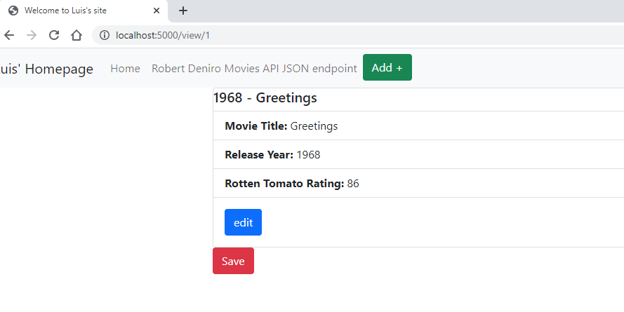

### Add Record on Web
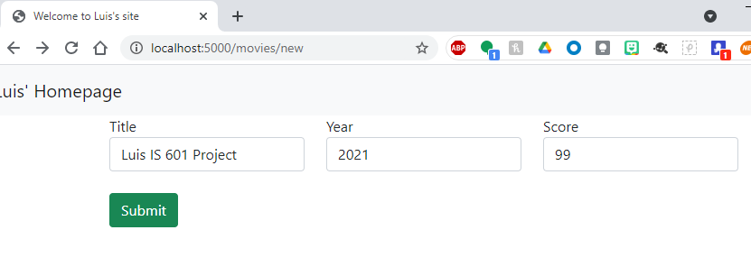

### Update Record on Web
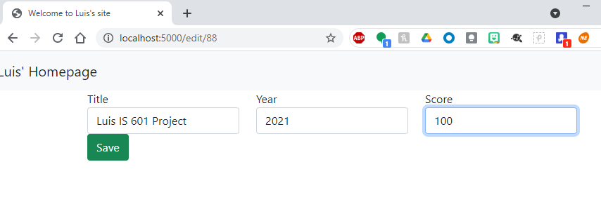

### Delete Record on Web
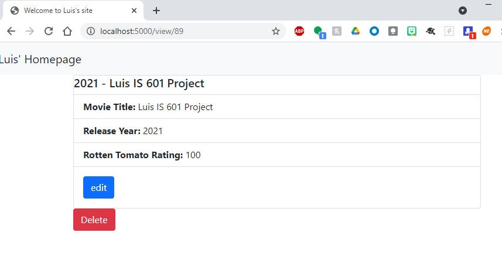

## Using Postman
### All records in Postman
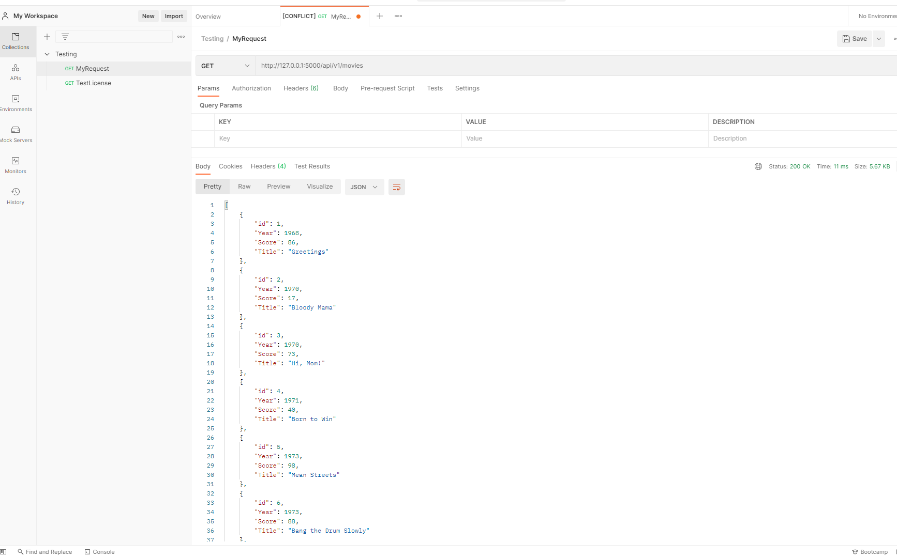

### View One Record in Postman
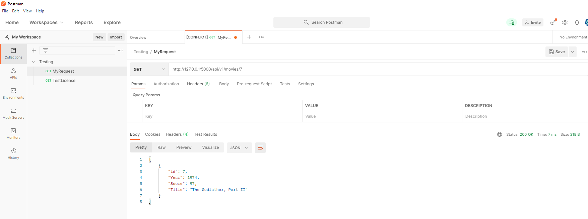

### Create Record in Postman
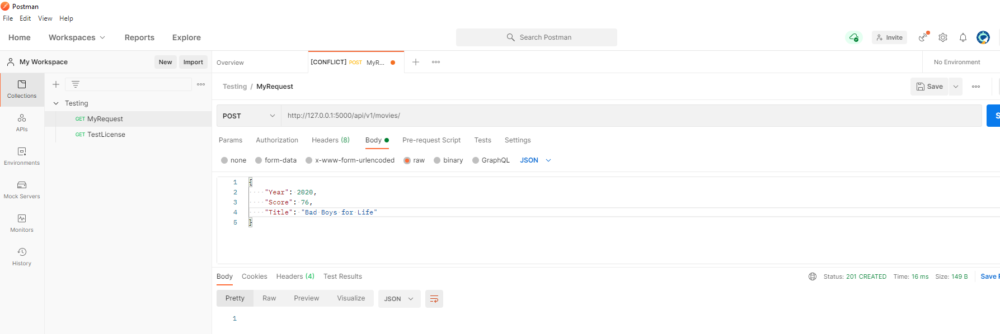

#### Edit Record in Postman
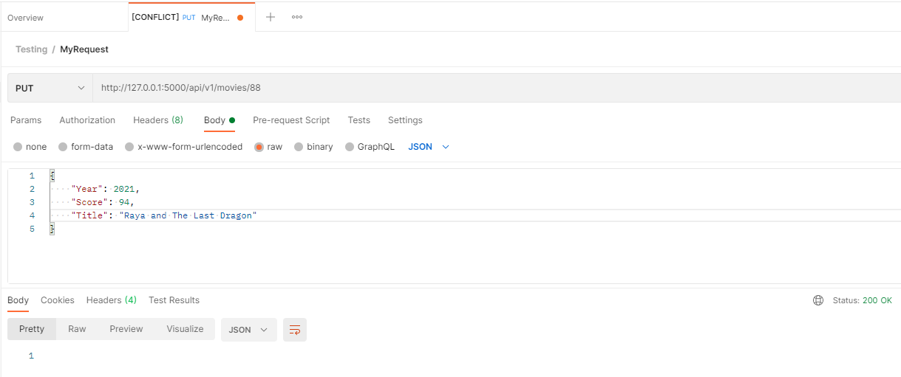

#### Delete Record in Postman
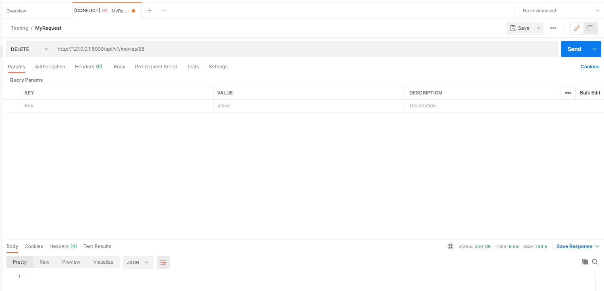